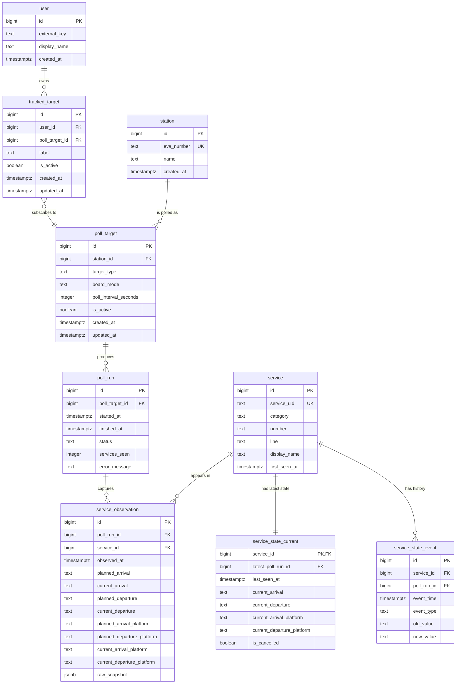

# Week 2 ER Diagram v1

This is the first high-level entity relationship diagram for BahnOps Week 2.

It captures:
- shared polling targets
- future multi-user subscriptions
- poll runs and observed services
- current state and historical service events

## Notes

- `poll_target` defines the shared scope that the system polls.
- `tracked_target` is the subscription layer that can later belong to a user.
- `poll_run` belongs to the shared `poll_target`, not to an individual user.
- `service_observation` stores what was seen in each poll.
- `service_state_current` stores the latest known state for quick reads.
- `service_state_event` stores meaningful historical changes.
