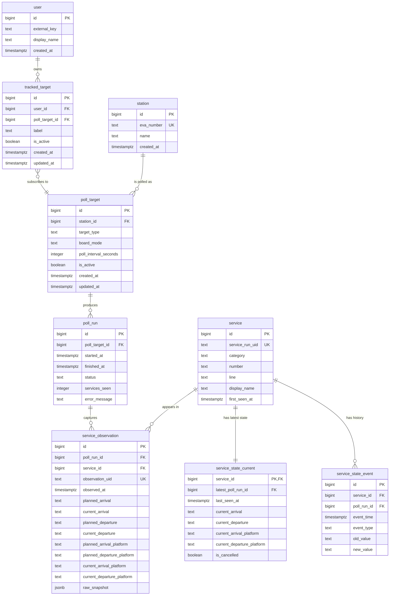

# Week 2 ER Diagram v1

This is the first high-level entity relationship diagram for BahnOps Week 2.

It captures:
- shared polling targets
- future multi-user subscriptions
- poll runs and observed services
- current state and historical service events
- the distinction between train labels, service runs, and stop-level observations

## Notes

- `poll_target` defines the shared scope that the system polls.
- `tracked_target` is the subscription layer that can later belong to a user.
- `poll_run` belongs to the shared `poll_target`, not to an individual user.
- `service` represents one concrete service run, not a timeless train number.
- `service_observation` stores what was seen in each poll at one specific stop-level board observation.
- `service_state_current` stores the latest known state for quick reads.
- `service_state_event` stores meaningful historical changes.

## Identity Rules

BahnOps needs three identity levels, not just one:

1. Train label

- Examples: `ICE 140`, `RE1`, `IC 2034`
- Derived from public-facing fields such as `category`, `number`, `line`, and `display_name`
- Used for cross-run analytics such as "average delay for ICE 140"
- Not unique across dates or concrete train occurrences

2. Service run identity

- Stored as `service.service_run_uid`
- Represents one concrete run of a train on a particular date/timetable occurrence
- Derived from the DB API `s/@id` by removing the final `-<stop_sequence>` segment
- Example:
  - full DB ID: `9061432001747394011-2605101519-5`
  - service run UID: `9061432001747394011-2605101519`
- This is the correct identifier for tracking a single run across multiple stations

3. Stop observation identity

- Stored as `service_observation.observation_uid`
- Uses the full DB API `s/@id` exactly as returned
- Example: `9061432001747394011-2605101519-5`
- This identifies one specific stop occurrence within a service run

## DB API ID Pattern

Live checks against the DB Timetables API on May 10, 2026 showed that the same run keeps the same prefix across stations while the final segment changes by stop sequence.

Examples:

- `ICE 140`
  - Berlin Ostbahnhof: `-5045088658159597679-2605101556-1`
  - Berlin-Spandau: `-5045088658159597679-2605101556-3`
  - Hannover Hbf: `-5045088658159597679-2605101556-4`

- `IC 2034`
  - Berlin Ostbahnhof: `9061432001747394011-2605101519-1`
  - Berlin Zoologischer Garten: `9061432001747394011-2605101519-3`
  - Berlin-Wannsee: `9061432001747394011-2605101519-4`
  - Potsdam Hbf: `9061432001747394011-2605101519-5`

This supports the working interpretation:

- full DB ID: `<run_root>-<base_timestamp>-<stop_sequence>`
- service run UID: `<run_root>-<base_timestamp>`
- observation UID: full DB ID

The exact semantic meaning of `base_timestamp` is still treated as an inference, not a proven API contract. For Week 2, it should be used as part of the run identity, not as standalone business logic.

## Naming Guidance

To keep the model clear:

- use `service_run_uid` for the run-level identifier
- use `observation_uid` for the full DB stop-level identifier
- keep `category`, `number`, `line`, and `display_name` for train-label analytics

Avoid naming the DB ID field `service_uuid` because it suggests a globally stable identity that the DB API does not appear to provide.
